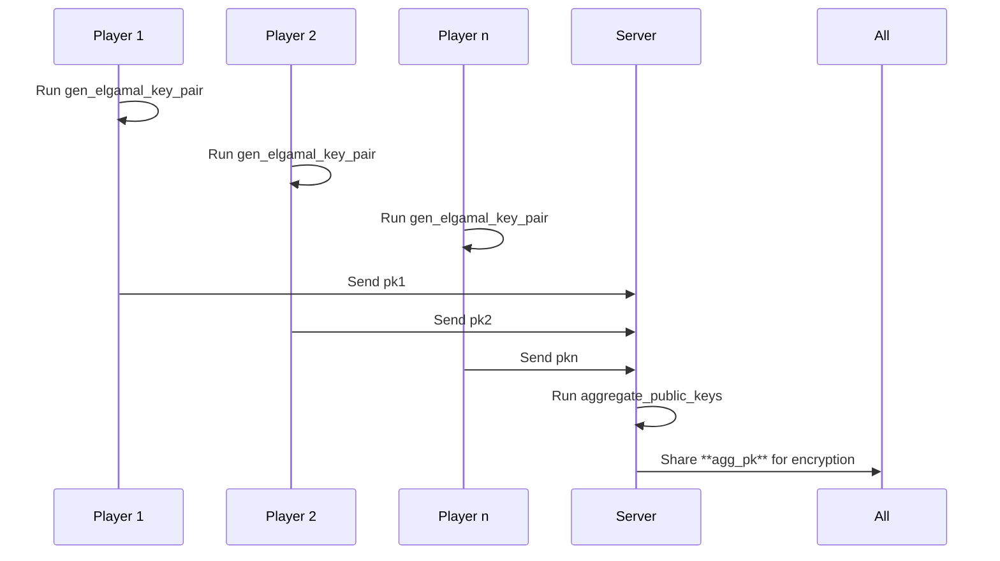

# 🧮 aggregate_public_keys

This circuit computes the **aggregate ElGamal public key** from a list of individual public keys. It's useful for distributed key generation, where multiple participants contribute to a shared public key without revealing their private keys.

## 🔧 How It Works

Given:

-   A list of public keys `pks: [Field; 10]`
    
-   A number `num_pks` specifying how many of the keys are active
    

The circuit multiplies the first `num_pks` entries in `pks` to compute the aggregate public key:

```
agg_pk = pks[0] * pks[1] * ... * pks[num_pks - 1]
```

## ✅ Example Inputs

```
pks = [
  "10460353203",
  "4052555153018976267",
  "1570042899082081611640534563",
  "0",
  "0",
  "0",
  "0",
  "0",
  "0",
  "0",
]
num_pks = "3"
```

## ➡️ Flow



