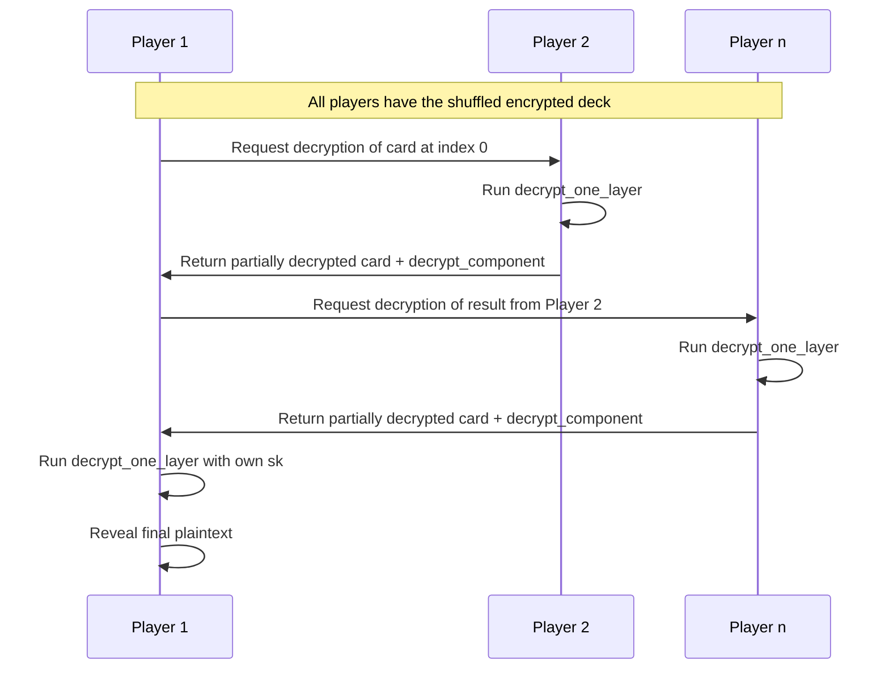
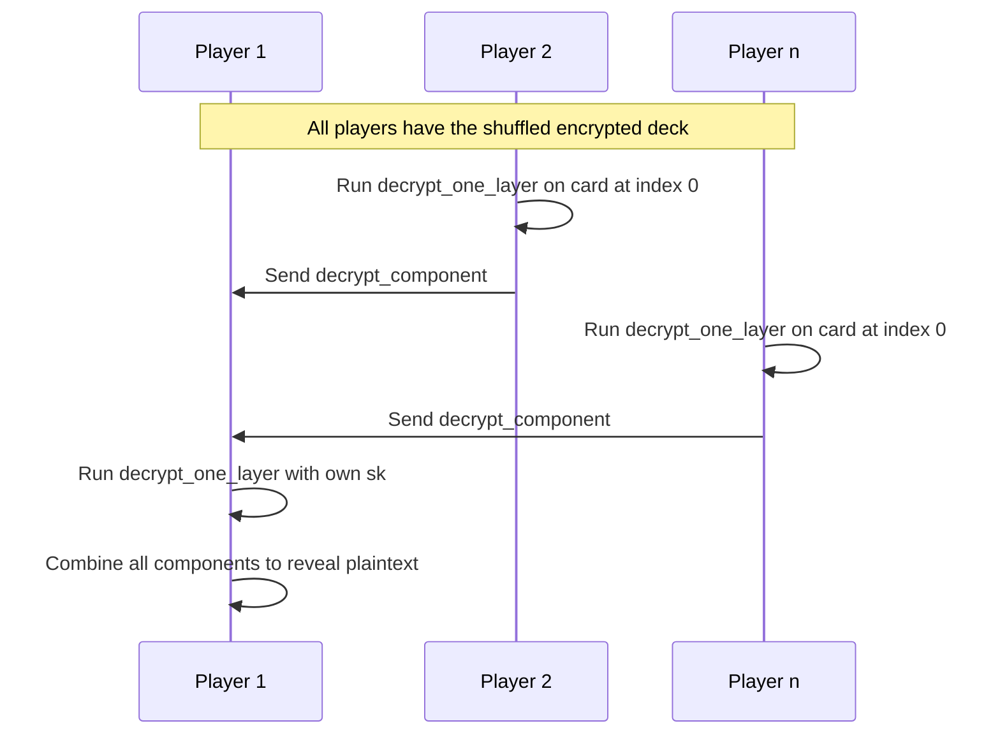

# 🧩 decrypt_one_layer

This circuit allows a participant to **decrypt one layer** of an ElGamal-encrypted card using their share of the secret key. It's a core building block in multi-party decryption protocols where each player peels off a layer without learning the full message unless they are the recipient.

## 🔧 How It Works

Given:

- `g: Field` — Generator of the group
- `card: [Field; 2]` — An encrypted card (ciphertext pair `[c1, c2]`)
- `sk: Field` — A single participant’s secret key share

The circuit outputs:

- `decrypted_card: [Field; 2]` — The result of partially decrypting `card` using `sk`
- `decrypt_component: Field` — The component derived from `c1^sk`, used to reconstruct or verify decryption

```
let (_, decrypted_card) = decrypt(g, card, sk);
let decrypt_component = calculate_decrypt_component(card[0], sk);
```

## ✅ Example Inputs

```
g = "3"
card = ["1", "42"]
sk = "22"
```

## ➡️ Flow



## 📝 Note

In practice, **each player does not need to pass a progressively decrypted card**. Instead, each player can **independently compute their decryption component** and send it to the final recipient. The recipient then combines all components to recover the original message.

Here’s how the decryption works:

```
m = c2 / (decrypt_component₁ × decrypt_component₂ × ... × decrypt_componentₙ)
```

Where:

- `m` is the recovered plaintext (e.g., the revealed role of the player)
- `c2` is the second element of the ciphertext, which contains the encrypted message
- `decrypt_componentᵢ = c1^skᵢ`, computed by each participant

This approach is more efficient and privacy-preserving, since no intermediate party learns or modifies the ciphertext during the process.

## ➡️ Flow (Optimized with Decrypt Components Only)


