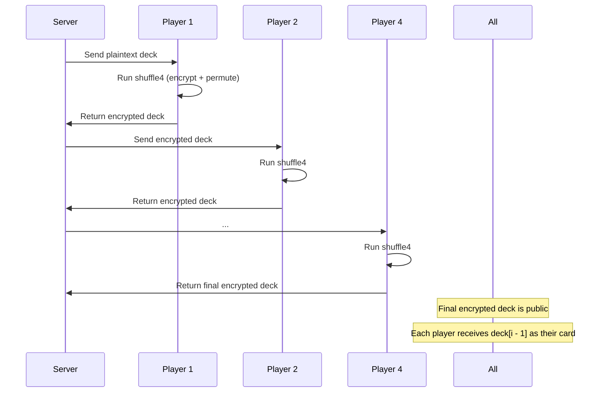

# 🔀 shuffle4

This circuit applies **ElGamal encryption and shuffling** to a deck of 4 cards. It allows a player to randomly permute and re-encrypt the deck using their randomness while preserving the integrity of the original card set.

It’s used in collaborative shuffling protocols, where each player hides the original card positions using encryption and a permutation matrix.

## 🔧 How It Works

Given:

- `g: Field` — Generator of the group
- `agg_pk: pub Field` — Aggregate public key shared by all players
- `deck: pub [[Field; 2]; 4]` — The current state of the 4-card deck (plaintext or encrypted)
- `rand: [Field; 4]` — Per-card randomness used to re-encrypt each card
- `perm: [[Field; 4]; 4]` — 4×4 permutation matrix indicating how cards are shuffled

The circuit outputs:

- `shuffled_deck: [[Field; 2]; 4]` — A new, re-encrypted and permuted deck

```
for i in 0..4 {
    encrypted_card = encrypt(g, agg_pk, deck[i], rand[i]);
    encrypted_deck[i][0] = encrypted_card[0];
    encrypted_deck[i][1] = encrypted_card[1];
}
shuffled_deck = mul_NxN_by_Nx2(perm, encrypted_deck);
```

## ✅ Example Inputs

```
g = "3"
agg_pk = "17"
deck = [
  ["1", "10"],
  ["1", "20"],
  ["1", "30"],
  ["1", "40"]
]
rand = ["77", "88", "99", "111"]
perm = [
  ["1", "0", "0", "0"],
  ["0", "1", "0", "0"],
  ["0", "0", "1", "0"],
  ["0", "0", "0", "1"]
]
```

## ➡️ Flow



## 📝 Notes

- **Only Player 1 sees the plaintext deck**. All subsequent players only see and permute the encrypted version.
- The permutation matrix must be a valid permutation (only one `1` per row and column).
- The randomness ensures ciphertext unlinkability between shuffle rounds.

This process is repeated in order for all `4` players, resulting in a collaboratively encrypted and shuffled deck where **no one knows the original position of any card**.
